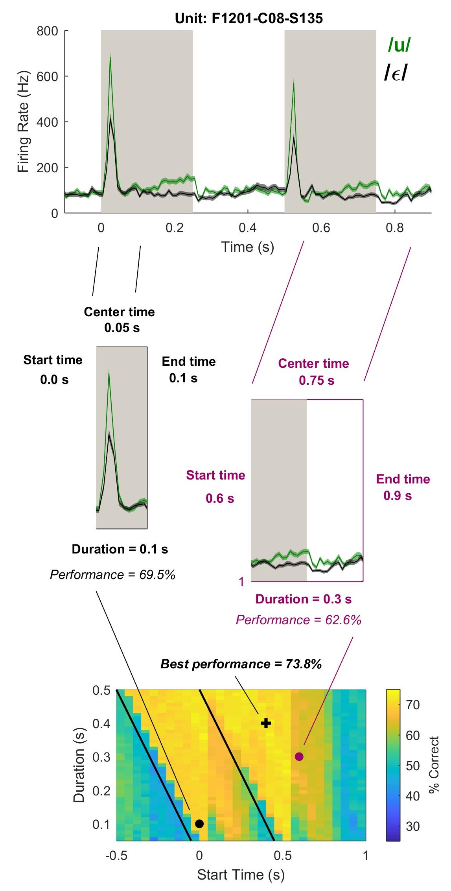

# Decoding

## Pattern Classification

The decoder is a simple nearest-centroid classifier that holds template responses for all unique labels (e.g. vowels) built from training data (time-varying firing rates averaged across multiple trials), and assigns an estimated label to held out data (time varying firing rates on single trials) based on euclidean distance. The process is visualized below:

  

Template formation and label estimation are performed using leave-out-out cross validation. Although slower, this allows the templates to be built from as many responses as possible; this can be important where units are tested on few trials, or where the number of labels is more than two (e.g. for sound level and fundamental frequency).

## Temporal Optimization
Auditory cortical units showed a wide variety of response profiles that made it difficult to select a single fixed time window over which to decode neural activity. To accommodate the heterogeneity of auditory cortical neurons and identify the time at which stimulus information arose, we repeated our decoding procedure using different time windows (n = 1550) varying in start time (-0.5 to 1 s after stimulus onset, varied at 0.1 s intervals) and duration (10 to 500 ms, 10 ms intervals):

  

Within this parameter space, we then reported the parameters that gave best decoding performance, and where several parameters gave best performance, we reported the time window with earliest start time and shortest duration.

## Statistical Analysis

  

