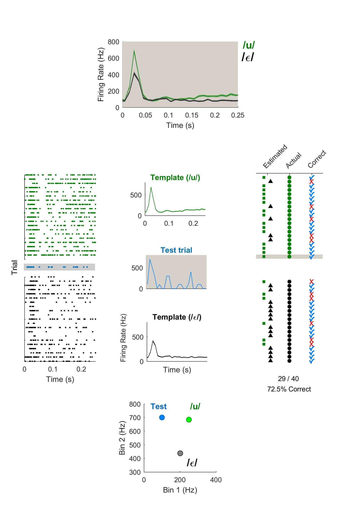

# Decoding

## Pattern Classification

The decoder is a simple nearest-centroid classifier that holds template responses for all unique labels (e.g. vowels) built from training data (time-varying firing rates averaged across multiple trials), and assigns an estimated label to held out data (time varying firing rates on single trials) based on euclidean distance. The process is visualized below:

## Temporal Optimization
