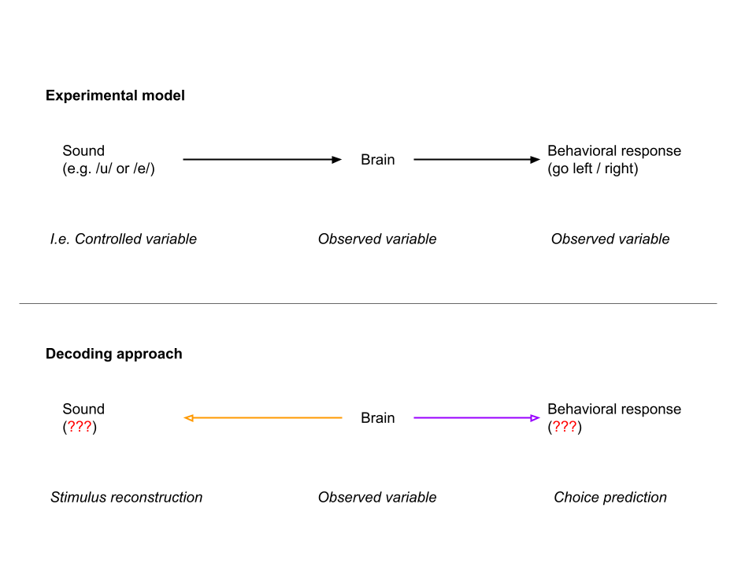

# Decoding

## 1. Motivation: Quantifying Information Content

The model design that underlies the project asserts that the brain (specifically auditory cortex) acts as an intermediary in a causal chain between sound presentation and listeners' behavior. We designed our experiment to thus investigate this pathway in highly controlled (and simplified) conditions in which we played one of two sounds and listerners' choices were restricted to one of two options (to make a left or right response). We also recorded from auditory cortical neurons to try and understand how the brain may be generating behavior from auditory input.

The diagram below shows the basic model with which we're working and obviously overlooks the fact that the brain is composed of many millions of neurons. We sample the activity of a small number of these neurons, each of which may or may not be involved in the generation of behavior (we cannot say because we lack access to a more detailed causal diagram that accurately captures the connectivity between neurons). Decoding provides a flexible and interpretible way to quantify how much information is available about sound input or behavioral output from the activity pattern of each neuron. We can use either a backwards approach to reconstruct sounds in the past from neural activity observed in the present, or a forwards model that predicts behavioral choices in the future from neural activity in the present. In this study we use both approaches: 

  

## 2. Pattern Classification

The decoder is a simple nearest-centroid classifier that holds template responses for all unique labels (e.g. vowels) built from training data (time-varying firing rates averaged across multiple trials), and assigns an estimated label to held out data (time varying firing rates on single trials) based on euclidean distance. The process is visualized below:

  

Template formation and label estimation are performed using leave-out-out cross validation. Although slower, this allows the templates to be built from as many responses as possible; this can be important where neurons are tested on few trials, or where the number of labels is more than two (e.g. for sound level and fundamental frequency).

## 3. Temporal Optimization
Auditory cortical units showed a wide variety of response profiles that made it difficult to select a single fixed time window over which to decode neural activity. To accommodate the heterogeneity of auditory cortical neurons and identify the time at which stimulus information arose, we repeated our decoding procedure using different time windows (n = 1550) varying in start time (-0.5 to 1 s after stimulus onset, varied at 0.1 s intervals) and duration (10 to 500 ms, 10 ms intervals):

  

Within this parameter space, we then reported the parameters that gave best decoding performance, and where several parameters gave best performance, we reported the time window with earliest start time and shortest duration.

## 4. Statistical Analysis
We conducted permutation tests in which the decoding procedure (including temporal optimization) was repeated 100 times but with the decoded feature randomly shuffled between trials to give a null distribution of decoder performance. The null distribution of shuffled decoding performance was parameterized by fitting a Gaussian probability density function, which we then used to calculate the probability of observing the real decoding performance. Units were identified as informative when the probability of observing the real performance after shuffling was < 0.05.

  

Note that because the decoding process involves an optimization step, the results from decoding of shuffled data will be >50%. This is the result of the decoder selecting the best time window in which to recover shuffled labels.

## 5. Population Decoding using Ensemble Models

Coming soon
