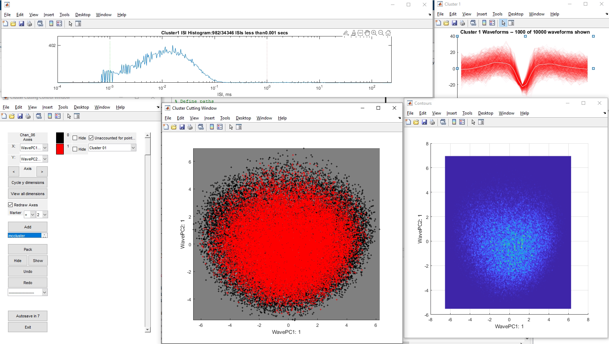

# Spike Extraction

Pipeline to extract single / multi-unit activity from signals recorded from single tungsten microelectrodes during behavior.

Because we're working with moving animals, there are a lot of movement artefacts in the data. To minimise the influence of these artefacts on the signal quality, we use a decorrelation function developed by [Musial et al. (2002)](https://europepmc.org/article/MED/11897361). The function works on high-pass filtered data and relies upon the idea that motion artefacts should be present on all channels of in an array of electrodes (here, we use arrays of 16 tungsten electrodes, separated by > 1 mm from each other).

When using the decorrelation function to minimise motion artefacts (signal cleaning), it is important to use a short period of time (i.e. several seconds, rather than minutes of recording). This requires that the recorded signal is thus split up into manageable segments (which we call *trial traces*) of a few seconds. Signal cleaning has some strange edge effects and so it's important that these segments are centered on key events such as stimulus presentation. This ensures that the edges of each segment are unlikely to contain neural activity of interest, and that activity in critical time windows is best preserved.

## 1. Get Trial Traces

Use a set of timestamps to sample chunks of neural activity around critical events (stimulus presentation and responses) via [*get_trial_traces.m*](cleanTrialTraces.m)

### Input Data
An example block, it's original (propriatary) format can be found on [FigShare](https://figshare.com/articles/dataset/Example_TDT_block_containing_original_data_from_perceptual_constancy_project/19948013). Blocks contain a variety of stream data, which can be loaded into Matlab using either the OpenDeveloper libraries (used here) or the [TDT toolbox for Matlab](https://www.tdt.com/docs/sdk/offline-data-analysis/offline-data-matlab/overview/) (which didn't exist at the time this project was conducted). Streams include:

| Store | Description |
| ---- | ----------------------------------------------------------------------------------------------------------- |
| BB_2 | Raw electrode data without filtering, 16 chans, recorded from left auditory cortex |
| BB_3 | Raw electrode data without filtering, 16 chans, recorded from right auditory cortex |
| SU_2 | High-pass filtered data for single / multi-unit activity, 16 chans, recorded from left auditory cortex |
| SU_3 | High-pass filtered data for single / multi-unit activity, 16 chans, recorded from right auditory cortex |
| Sens | Downsampled records of IR sensors used in center, left and right response ports |
| Sond | Downsampled records of output to left and right speakers |
| Valv | Downsampled records of output to solenoids for water delivery from center, left and right response ports |

### Rationale

The cartoon below shows how chunks are timed around trials. Operating on the principle that shorter chunks are better for cleaning, we try not to include long periods of activity between a response and the next trial, but we do try to keep all the activity from just before stimulus onset until just after a response is made (as this is when we expect any neural computation to be most relevant)

The image below shows real chunks (grey zones) taken from the sample data availble in the links.

### Output Files

An example file containing chunked neural data, ahead of cleaning can be found [here](https://figshare.com/articles/dataset/Example_of_chunked_neural_data_from_perceptual_constancy_project/19947965). It contains:

| Variable     | Description |
| ------------ | -------------------------------------------------------------------------------------------------------|
| bdata        | struct containing the original behavioral data used to generate timestamps |
| M            | an *n-by-2* array containing the start and end times of each chunk, where *n* is the number of chunks |
| trial_traces | an *n-by-m* cell array containing the high-pass signal in each of *n* chunks, on each of *m* electrodes* |

 *Note that electrodes in left auditory cortex are numbered 1-16 and electrodes in right auditory cortex are numbered 17-32

 

## 2. Clean Trial Traces

To clean data chunks, call [cleanTrialTraces.m](./cleanTrialTraces.m).

### Input Files

Input files are the trial trace output files described above.

### How It Works

cleanTrialTraces.m runs as a batch function, where it detects all .mat files stored in the input directory and assumes that each contains trial traces. It then iterates through each file, cleaning the chunks of data 

The function [CleanData.m](./CleanData.m) is called on each chunk of data and returns a matrix with the cleaned data in, plus some components scores that we don't include in the output. Input values must be either double or single data types, and chunks cannot contain NaNs, and any missing data needs to be replaced with a holding value such as zero.

Cleaning is performed separately on data recorded from each different array (e.g. left and right auditory cortex). This is because each array is considered to be independent, as it has a separate connection to the TDT system. The output is also then split into separate files for the cleaned data from each array.

### Output Files

Separate files are saved for each array (e.g. left and right auditory cortex, with SU2 and SU3 suffixes). An example can be downloaded from [FigShare](https://figshare.com/articles/dataset/Example_of_cleaned_neural_data_from_perceptual_constancy_project/19947944)

| Variable     | Description |
| ------------ | -------------------------------------------------------------------------------------------------------|
| bdata        | struct containing the original behavioral data used to generate timestamps |
| M            | an *n-by-2* array containing the start and end times of each chunk, where *n* is the number of chunks |
| cleanTrials_SU2 | an *n-by-1* cell array of *n* chunks; each cell contains a *p-by-m* matrix of cleaned signals from *m* electrodes |
| chans | an *m-by-2* array containing channel numbers (this is largely superfluous, given the information in the current readMe) |

## 3. Event Detection

### Input Files
Candidate events for spike sorting are extracted from cleaned data using [getMClustEvents_AlignedInterpolated.m](.\getMClustEvents_AlignedInterpolated.m). The function has batch capability and is usually run on several data files (though technically it doesn't matter if there's ten files, or just one). The input files are generated at the end of the cleaning, described above.

### How it works

Spike detection uses a basic threshold detection process to identify times that exceed some negative value. We then take a time window around that threshold crossing, do some realignment to make sure all waveforms are ordered relative to their lowest point (to get a clear picture of spike shape) and then save.

The **time window** for spike selection is an important consideration; here we select a 32 sample window (~1.3 milliseconds) centered about the trough of the spike. Extended the time window to a larger duration might be feasible, but as the window becomes longer, it becomes the more likely that spurious features of the waveform will be introduced into the analysis. For the cleaned signal recorded on each electrode, we only consider spikes that have negative deflections between -2.5 and -6 standard deviations of the signal. These **thresholds** could be changed to make the process more or less selective; the values here were chosen as they tended to work well for the signals we recorded (though more recently we have shifted to using -3 and -8 standard deviations). There is also a hard-limit on the thresholds, to ensure they aren't ridiculously low or high. Finally, we include some **interpolation** to generate a smooth waveform shape from the available data. This can be helpful when it comes to spike sorting later - though the example spike waveforms shown here don't include interpolation (this was a late feature in the project, but it's worked well since then).

### Output Files

Seperate .mat files are produced for each channel in an electrode array, and stored in a folder that contains all outputs for that array (e.g. left auditory cortex, held in a directory with the SU2 suffix in the name). An example output directory can be found in [data/spike_times](..\data\spike_times), although for size considerations, only one channel is included ([Chan_06.mat](..\data\spike_times\Chan_06.mat)). Further examples can be downloaded from [FigShare](https://figshare.com/articles/dataset/Example_of_spike_times_extracted_from_clean_data_in_perceptual_constancy_project/19947977).

| Variable | Description |
| -------- | -------------------------------------------------------------------------------------------------------|
| t        | a *1-by-n* array containing timestamps for *n* spikes, with times in seconds|
| wv       | an *n-by-m* array containing *n* waveforms, each with *m* samples|

## 4. Spike Sorting in MClust

### Input Files
Spike sorting procedes one channel at a time, using the individual .mat files outputted by the event detection stage described above.

### MClust

[MClust](https://github.com/adredish/MClust-Spike-Sorting-Toolbox) is a separate application, designed by the Redish lab; however the version (v.3.5)  used in this project on perceptual constancy predates the version of MClust available on GitHub, and used a custom loading function ([loadTDT_PerceptualConstancy.m](.\MClust_mods\loadTDT_PerceptualConstancy.m)) designed specifically for the data format currently used. Most of the custom functions are listed in "MClust_mods", where some code has been adapted. 

One important consideration is that MClust is designed to work with tetrode data, and so to get single channel data into MClust, we replicate the signal on each channel. The default settings for MCLust are also overriden so that features are only calculated on a single channel. The screenshot below shows MClust on startup, illustrating the functionality:

MClust has a variety of features to manually sort spikes; however most of these are overkill for the signals recorded on single tungsten microelectrodes, where it's very rare to record more than one neuron or multi-unit cluster. The *feature space* can be used to look for clusters, which can then be manually labelled or subject to an algorithm (e.g. KlustaKwik). There are several quality inspection features such as the *waveform shape* and *inter-spike interval (ISI) histogram*. Usually we distinguish a single unit as that with less than 1% of spikes with ISIs below 1 ms. In the example below, you can see a clear multi-unit recording, where many spikes occur below the 1 ms threshold.

  

A particularly useful tool for noisy data is the *waveform cutter*, which allows you to filter out large amplitude events from around a candidate spike. This is essentially a form of manual template formation, but generally works well to remove noise that doesn't fit the patter of the spike, especially when there is only one unit on the electrode.

Below is the same unit after some quick cleaning to remove large noisy events... note that clustering approaches will just split the data into multiple parts that include both noise and signal and, at least in my experience, don't do well at sorting single electrode data.

  

### Output

When loading spikes for analysis, MClust creates a number of feature files (see the feature selection dialog box in the initial MClust GUI) with the *.fd suffix. These are not critical in the long-term and can be regenerated if needed; however examples are included in the repository for completeness.

After spike sorting, the user selects 'Write Files' and a separate .mat file is saved in the same directory as the input data, with the cluster number as a suffix. The respository includes an example in which the input file 'Chan_06.mat' has been sorted and saved, resulting in the output file 'Chan_06 **_1** .mat'. This contains the spike times (TS, an *p-by-1* vector) of a subset of spikes from the input file, assigned to the cluster. This can then be used for future decoding or cross-referencing waveform shape etc.) 

